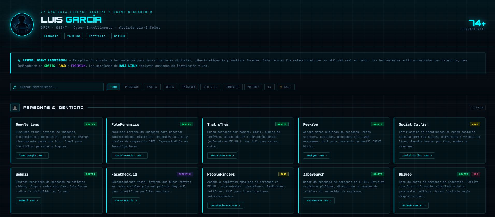

# 🛡️ Arsenal OSINT Profesional — Luis García

> Colección curada de herramientas, recursos y técnicas de inteligencia en fuentes abiertas (OSINT) para investigadores, analistas forenses digitales y profesionales de ciberseguridad. Todo en un único archivo HTML interactivo.

[](https://proyects-luis.netlify.app)
[](https://es.wikipedia.org/wiki/OSINT)
[](https://developer.mozilla.org/es/docs/Web/HTML)

---

## 🚀 Acceso rápido

**👉 [Ver Arsenal completo](https://proyects-luis.netlify.app)**

O descargá `index.html` y abrilo directo en tu browser — sin instalación, sin dependencias.

---

## ✨ ¿Qué incluye?

El arsenal está organizado por categorías:

- 🔍 **Búsqueda de personas** — nombres, alias, emails, teléfonos
- 🌐 **OSINT en redes sociales** — Instagram, Facebook, LinkedIn, Twitter/X
- 📧 **Investigación de emails** — verificación, breach, headers
- 📱 **OSINT de teléfonos** — geolocalización, operadora, registros
- 🗺️ **Geolocalización e imágenes** — EXIF, reverse image, mapas
- 🏢 **Empresas y dominios** — WHOIS, registros, certificados
- ⚖️ **Registros judiciales y públicos** — Argentina y Latinoamérica
- 🔐 **Análisis de contraseñas y hashes** — crackeo, diccionarios
- 🕵️ **Dark web y filtraciones** — breach databases, monitoreo
- 🛠️ **Herramientas de red** — Shodan, Censys, análisis de tráfico

---

## 🛠️ Stack técnico

| Tecnología | Uso |
|---|---|
| **HTML5 / CSS3 / JS vanilla** | Interfaz completa sin frameworks |
| **JetBrains Mono + Orbitron** | Tipografía técnica |
| **Google Fonts** | Carga de fuentes |

---

## 📁 Estructura

```
arsenal-osint/
├── index.html           # Arsenal completo — todo en un archivo
├── Arsenal_OSINT_LuisGarcia.docx  # Versión documento
└── README.md
```

---

## ⚠️ Uso ético

Todas las herramientas listadas deben usarse **dentro del marco legal vigente** y con **autorización explícita** cuando corresponda. Este arsenal está pensado para:

- Investigadores y analistas de ciberseguridad
- Fuerzas de seguridad y organismos públicos
- Profesionales de forense digital
- Estudiantes de ciberseguridad en entornos controlados

---

## 📸 Screenshots




---

## 👤 Autor

**Luis García** — [@LuisGarcia-InfoSec](https://www.linkedin.com/in/luis-garc%C3%ADa-8138762b6/)  
Analista de Ciberseguridad & Forense Digital · Buenos Aires, Argentina  
🌐 [proyects-luis.netlify.app](https://proyects-luis.netlify.app)

---

*Compartido con la comunidad de ciberseguridad hispanohablante.*
